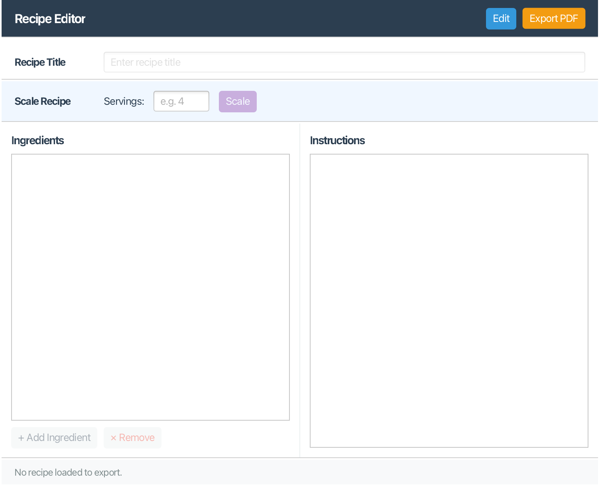
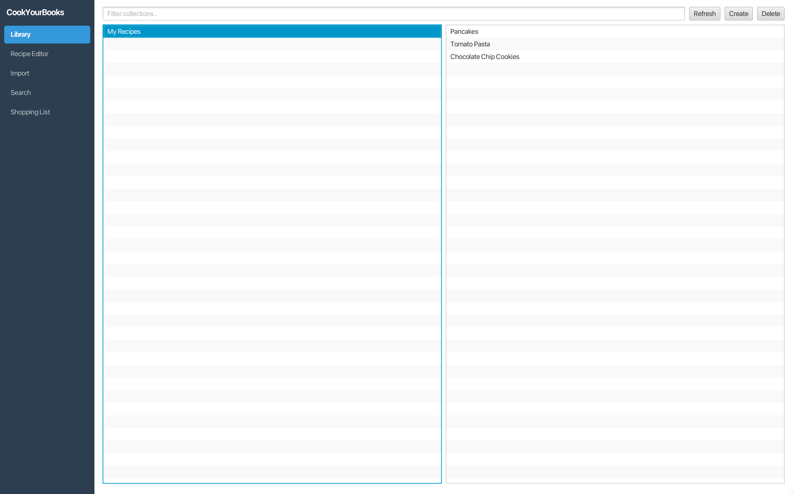
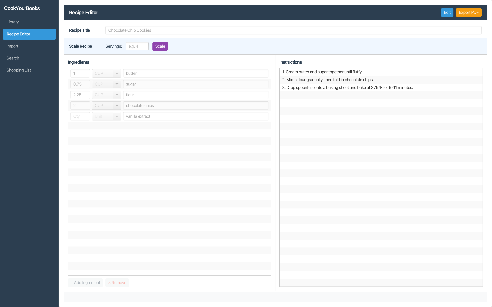
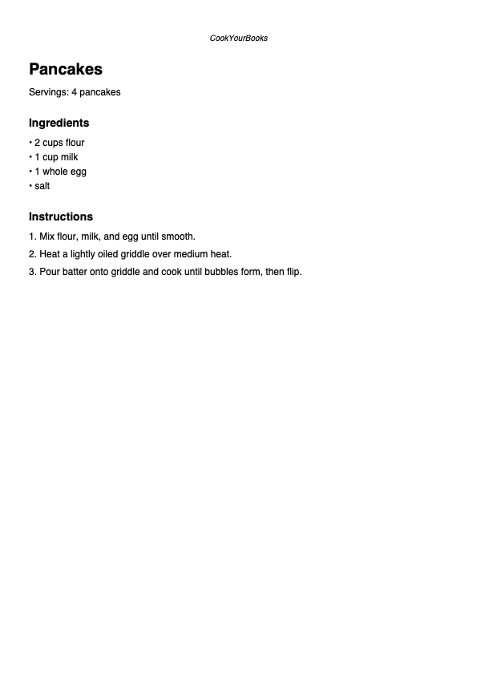

# CookYourBooks

A desktop recipe management application for digitizing, organizing, and managing recipes from physical cookbooks and websites. Built with Java and JavaFX as part of Northeastern University's CS 3100 (Program Design & Implementation 2).

## Features

- **Recipe Import** — Import recipes from JSON files, plain text, and images via the Gemini API
- **Search & Filter** — Search recipes by title or ingredient, filter by tags, with full keyboard navigation
- **Export to PDF** — Generate formatted PDF exports of recipes
- **Recipe Scaling** — Adjust serving sizes with automatic ingredient recalculation
- **Unit Conversion** — Convert between metric and imperial units with layered priority (house > recipe-specific > global)
- **Interactive CLI** — Rich command-line interface with tab completion, command history, and contextual help
- **Library Management** — Browse and manage cookbooks, personal collections, and web collections

## Architecture

The application follows a **hexagonal architecture** with clear separation of concerns:

- **Domain Layer** — Rich object model for recipes, ingredients, quantities, and cookbooks
- **Service Layer** — Business logic for import, scaling, conversion, search, and shopping list generation
- **Persistence Layer** — JSON-based repositories using Jackson for serialization
- **UI Layer** — JavaFX GUI built with the MVVM pattern, plus a CLI built with JLine 3 as a driving adapter

## Tech Stack

- **Language:** Java
- **GUI Framework:** JavaFX (MVVM architecture)
- **CLI:** JLine 3
- **Build Tool:** Gradle
- **Testing:** JUnit 5, Mockito, TestFX
- **Serialization:** Jackson (JSON)
- **AI Integration:** Gemini API (recipe import from images)

## My Contributions

This was a team project (Group 4619). I was responsible for:

- **Search & Filter (Core Feature)** — Full implementation of the search and filter ViewModel and view, including keyword search, tag-based filtering, and keyboard navigation
- **Export to PDF (Feature Buffet)** — Designed and implemented formatted PDF generation for recipes, including layout, styling, and integration with the export workflow
- **CLI Development** — Contributed to the interactive CLI with JLine 3, implementing command routing and the hexagonal adapter pattern

## Screenshots

## Team

- Hosam — Search & Filter, Export to PDF
- Rishika Kothari
- Mohamed Ali
- Angela You

## Course

CS 3100: Program Design & Implementation 2 — Northeastern University, Spring 2026
